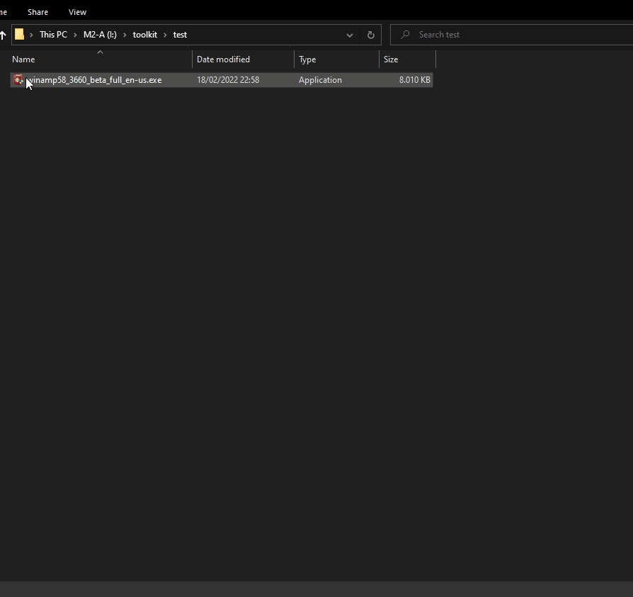

English | [Español](README.ES.md)

# Indetectables Toolkit

This tool compilation is carefully crafted with the purpose of being useful both for the beginners and veterans from the malware analysis world. It has also proven useful for people trying their luck at the cracking underworld.

It's the ideal complement to be used with the [manuals](https://github.com/indetectables-net/manuals) from the site, and to play with the [numbered theories](https://github.com/indetectables-net/teorias-numeradas) mirror.

## Advantages

To be clear, this pack is thought to be the most complete and robust in existence. Some of the pros are:

1. It contains all the basic (and not so basic) tools that you might need in a real life scenario, be it a simple or a complex one.

2. The pack is integrated with an Universal Updater made by us from scratch. Thanks to that, we get to mantain all the tools in an automated fashion.

3. It's really easy to expand and modify: you just have to update the file `bin\updater\tools.ini` to integrate the tools you use to the [updater](https://github.com/xchwarze/universal-tool-updater), and then add the links for your tools to `bin\sendto\sendto`, so they appear in the context menus.

4. The installer sets up everything we might need automatically - everything, from the dependencies to the environment variables, and it can even add a scheduled task to update the whole pack of tools weekly.

## Installation

1. You can clone the repository with [git](https://git-scm.com/download/win), or you can also [download it](https://github.com/indetectables-net/toolkit/archive/refs/heads/master.zip). Alternatively, you can simply download the stable versions from the [release section](https://github.com/indetectables-net/toolkit/releases), where you can also find the installer.

2. Once downloaded, you can update the tools with the Universal Updater that we specifically [developed](https://github.com/xchwarze/universal-tool-updater) for that sole purpose.  . 
You will find the binary in the folder `bin\updater\updater.exe`.

## Tool set

This toolkit is composed by 75 apps that cover everything we might need to perform reverse engineering and binary/malware analysis.  
Every tool has been downloaded from their original/official websites, but we still recommend you to use them with caution, specially those tools whose official pages are forum threads. Always exercise common sense.  
You can check the complete list of tools [here](TOOLS.md).

## About contributions

Pull Requests are welcome. If you'd want to propose big changes, you should first create an Issue about it, so we all can analyze and discuss it. The tools are compressed with 7-zip, and the format used for nomenclature is `{name} - {version}.7z`
