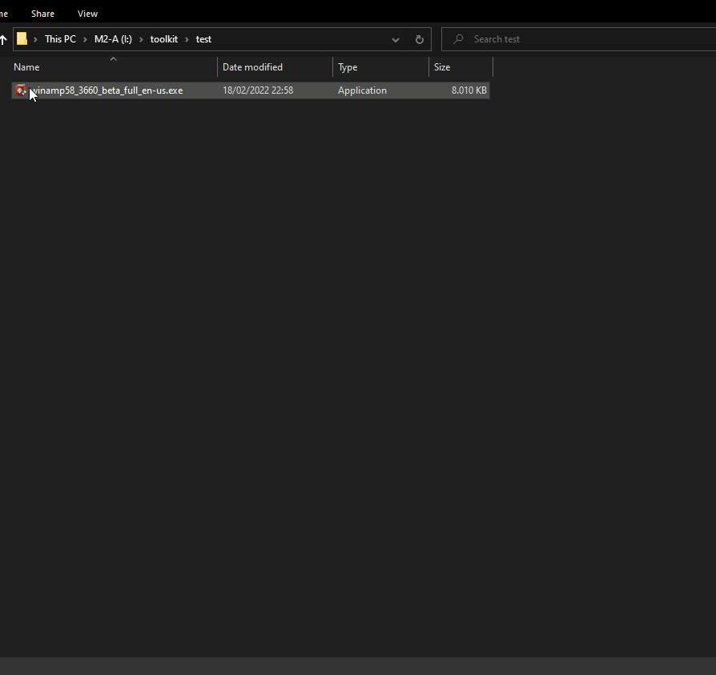

English | [Español](README.ES.md)

# Indetectables Toolkit

Designed as a Swiss Army knife, this curated toolkit is invaluable for malware analysts, crackers, and cybersecurity experts. It is meticulously crafted to support both novice and experienced users.

This toolkit complements the [manuals](https://github.com/indetectables-net/manuals) and the [numbered theories](https://github.com/indetectables-net/teorias-numeradas) mirror from our site.

## Advantages

1. **Comprehensive**: Contains all essential tools for both simple and complex scenarios.
2. **Automated Updates**: Integrated with a custom [Universal Updater](https://github.com/xchwarze/universal-tool-updater) to keep tools updated automatically.
3. **Extensible**: Easily add new tools by updating `bin\updater\tools.ini` and linking them in `bin\sendto\sendto`.
4. **Automatic Setup**: The installer handles dependencies, environment variables, and can schedule weekly updates.
5. **Context menu integration**: Registers [SendTo Recomposed](https://github.com/xchwarze/sendto-recomposed) in the Windows right-click menu for files.

## Installation

1. Download the stable version from the [release section](https://github.com/indetectables-net/toolkit/releases).
2. Use the Universal Updater in `bin\updater\updater.exe` to keep tools updated.
3. If you need to download a specific tool, they are all compressed in the toolkit folder of this repo.

Each release ships two installers: **full** (`toolkit-{version}.exe`), with every tool listed below, and **lite** (`toolkit-{version}-lite.exe`), a leaner selection — see the [lite tool list](TOOLS-LITE.md). A handful of tools also ship as separate, optional **extras** packs (`extras-{version}-{name}.exe`: ghidra, oldies, unpacking, vbdec), available on the same releases page and marked in [TOOLS.md](TOOLS.md) as *Available using the extra called: X*.

## The Tool Set

The toolkit includes 102 apps covering a wide range of needs. It features both well-known tools and lesser-known, yet highly useful ones, as well as rare tools that are hard to find. **All tools are sourced from their official websites, but exercise caution, especially with tools from forum threads.** View the [complete tool list here](TOOLS.md).

This toolset is inspired by the old *Crackers Kits* that gained popularity around 2010, but with all their limitations and flaws addressed. We based it on the tools we have traditionally recommended within our community.

Our first release was version 2020.2, published on February 17, 2020, which makes this a more veteran —and actively maintained— project than many current alternatives.

## Contributions

Pull Requests are welcome. For major changes, create an Issue for discussion. Tools are compressed with 7-zip, using the format `{name} - {version}.7z`.
